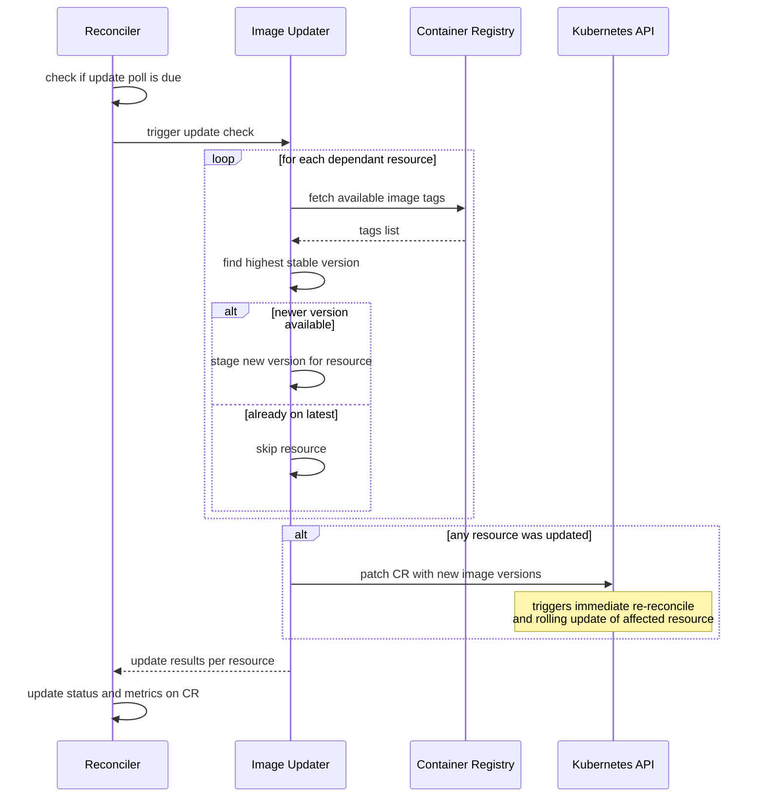

## Image Auto-Update Process

```mermaid
sequenceDiagram
    participant R as Reconciler
    participant IU as Image Updater
    participant Reg as Container Registry
    participant K8s as Kubernetes API

    R->>R: check if update poll is due

    R->>IU: trigger update check

    loop for each dependant resource
        IU->>Reg: fetch available image tags
        Reg-->>IU: tags list

        IU->>IU: find highest stable version

        alt newer version available
            IU->>IU: stage new version for resource
        else already on latest
            IU->>IU: skip resource
        end
    end

    alt any resource was updated
        IU->>K8s: patch CR with new image versions
        Note over K8s: triggers immediate re-reconcile<br/>and rolling update of affected resource
    end

    IU-->>R: update results per resource

    R->>R: update status and metrics on CR
```