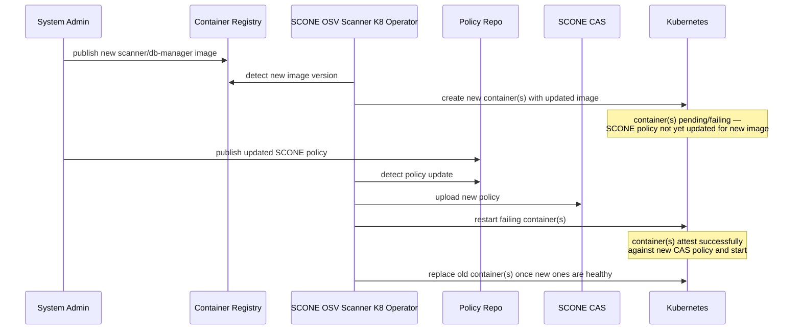

## OSV Scanner Service Update Flow

```mermaid
sequenceDiagram
    participant Admin as System Admin
    participant Reg as Container Registry
    participant Op as SCONE OSV Scanner K8 Operator
    participant PR as Policy Repo
    participant CAS as SCONE CAS
    participant K8s as Kubernetes

    Admin->>Reg: publish new scanner/db-manager image

    Op->>Reg: detect new image version
    Op->>K8s: create new container(s) with updated image

    Note over K8s: container(s) pending/failing —<br/>SCONE policy not yet updated for new image

    Admin->>PR: publish updated SCONE policy

    Op->>PR: detect policy update
    Op->>CAS: upload new policy

    Op->>K8s: restart failing container(s)
    Note over K8s: container(s) attest successfully<br/>against new CAS policy and start

    Op->>K8s: replace old container(s) once new ones are healthy
```
