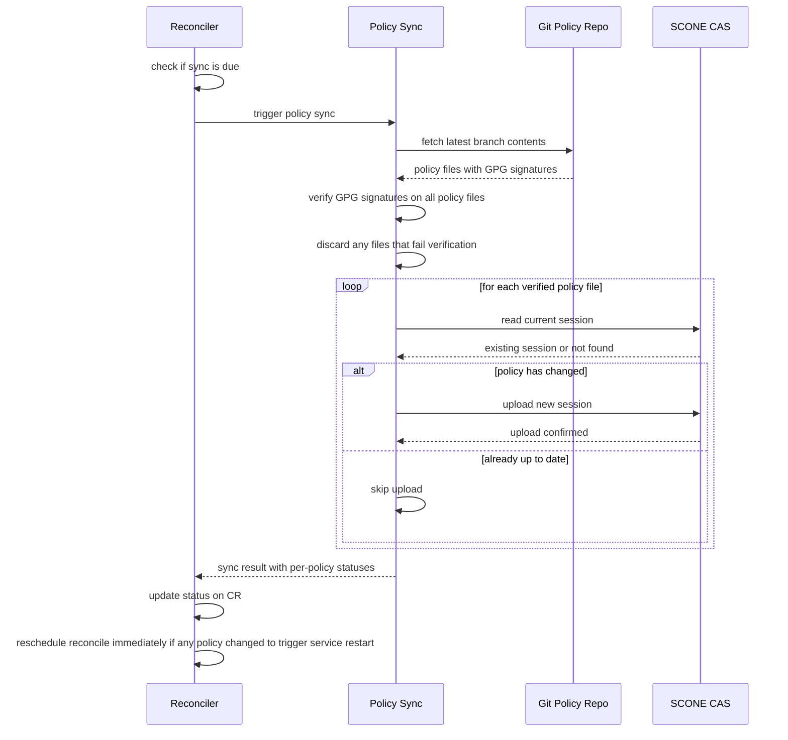

## Policy Upload Process

```mermaid
sequenceDiagram
    participant R as Reconciler
    participant PS as Policy Sync
    participant Git as Git Policy Repo
    participant CAS as SCONE CAS

    R->>R: check if sync is due
    R->>PS: trigger policy sync

    PS->>Git: fetch latest branch contents
    Git-->>PS: policy files with GPG signatures

    PS->>PS: verify GPG signatures on all policy files
    PS->>PS: discard any files that fail verification

    loop for each verified policy file
        PS->>CAS: read current session
        CAS-->>PS: existing session or not found

        alt policy has changed
            PS->>CAS: upload new session
            CAS-->>PS: upload confirmed
        else already up to date
            PS->>PS: skip upload
        end
    end

    PS-->>R: sync result with per-policy statuses

    R->>R: update status on CR
    R->>R: reschedule reconcile immediately if any policy changed to trigger service restart
```
