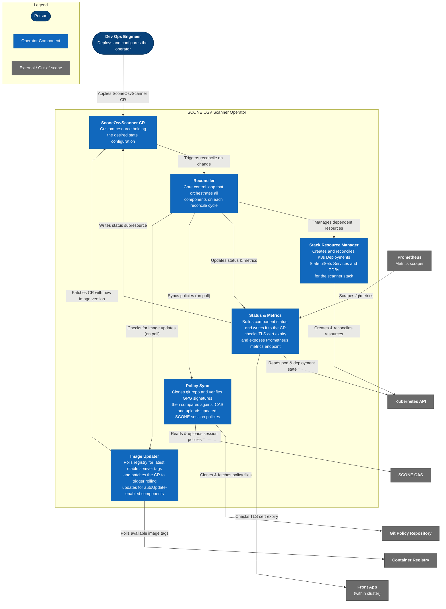

## Component

```mermaid
%%{init: {"flowchart": {"curve": "linear"}}}%%
flowchart TB
    devops(["<b>Dev Ops Engineer</b><br/>Deploys and configures the operator"])
    prometheus["<b>Prometheus</b><br/>Metrics scraper"]

    subgraph system["SCONE OSV Scanner Operator"]
        cr["<b>SconeOsvScanner CR</b><br/>Custom resource holding<br/>the desired state configuration"]
        reconciler["<b>Reconciler</b><br/>Core control loop that orchestrates all<br/>components on each reconcile cycle"]
        stackManager["<b>Stack Resource Manager</b><br/>Creates and reconciles K8s Deployments<br/>StatefulSets Services and PDBs<br/>for the scanner stack"]
        statusMetrics["<b>Status & Metrics</b><br/>Builds component status and writes it to the CR<br/>checks TLS cert expiry<br/>and exposes Prometheus metrics endpoint"]
        policySync["<b>Policy Sync</b><br/>Clones git repo and verifies GPG signatures<br/>then compares against CAS<br/>and uploads updated SCONE session policies"]
        imageUpdater["<b>Image Updater</b><br/>Polls registry for latest stable semver tags<br/>and patches the CR to trigger rolling<br/>updates for autoUpdate-enabled components"]
    end

    k8sapi["<b>Kubernetes API</b>"]
    cas["<b>SCONE CAS</b>"]
    gitrepo["<b>Git Policy Repository</b>"]
    registry["<b>Container Registry</b>"]
    frontApp["<b>Front App</b><br/>(within cluster)"]

    subgraph legend["Legend"]
        l_person(["Person"])
        l_component["Operator Component"]
        l_external["External / Out-of-scope"]
    end

    devops -->|"Applies SconeOsvScanner CR"| cr
    cr -->|"Triggers reconcile on change"| reconciler

    reconciler -->|"Manages dependent resources"| stackManager
    reconciler -->|"Updates status & metrics"| statusMetrics
    reconciler -->|"Syncs policies (on poll)"| policySync
    reconciler -->|"Checks for image updates (on poll)"| imageUpdater

    stackManager -->|"Creates & reconciles resources"| k8sapi
    statusMetrics -->|"Reads pod & deployment state"| k8sapi
    statusMetrics -->|"Writes status subresource"| cr
    statusMetrics -->|"Checks TLS cert expiry"| frontApp
    prometheus -->|"Scrapes /q/metrics"| statusMetrics

    policySync -->|"Clones & fetches policy files"| gitrepo
    policySync -->|"Reads & uploads session policies"| cas

    imageUpdater -->|"Polls available image tags"| registry
    imageUpdater -->|"Patches CR with new image version"| cr

    stackManager ~~~ statusMetrics ~~~ policySync ~~~ imageUpdater
    k8sapi ~~~ cas ~~~ gitrepo ~~~ registry ~~~ frontApp

    classDef component fill:#1168bd,stroke:#0e5fa3,color:#fff
    classDef external fill:#6b6b6b,stroke:#4a4a4a,color:#fff
    classDef person fill:#08427b,stroke:#052e56,color:#fff

    class cr,reconciler,stackManager,statusMetrics,policySync,imageUpdater,l_component component
    class k8sapi,cas,gitrepo,registry,frontApp,prometheus,l_external external
    class devops,l_person person
```