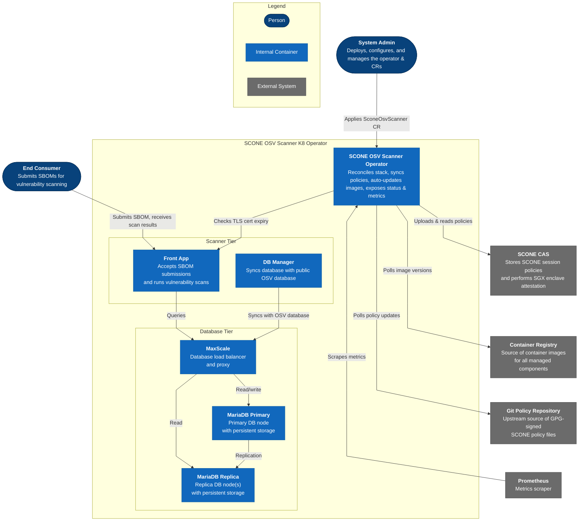

## Container

```mermaid
%%{init: {"flowchart": {"curve": "linear"}}}%%
flowchart TB
    devops(["<b>System Admin</b><br/>Deploys, configures, and manages the operator & CRs"])
    consumer(["<b>End Consumer</b><br/>Submits SBOMs for vulnerability scanning"])
    cas["<b>SCONE CAS</b><br/>Stores SCONE session policies<br/>and performs SGX enclave attestation"]
    registry["<b>Container Registry</b><br/>Source of container images<br/>for all managed components"]
    gitrepo["<b>Git Policy Repository</b><br/>Upstream source of GPG-signed<br/>SCONE policy files"]
    prometheus["<b>Prometheus</b><br/>Metrics scraper"]

    subgraph system["SCONE OSV Scanner K8 Operator"]
        operator["<b>SCONE OSV Scanner Operator</b><br/>Reconciles stack, syncs policies, auto-updates images, exposes status & metrics"]

        subgraph scannerTier["Scanner Tier"]
            frontApp["<b>Front App</b><br/>Accepts SBOM submissions<br/>and runs vulnerability scans"]
            dbManager["<b>DB Manager</b><br/>Syncs database with public OSV database"]
        end

        subgraph dbTier["Database Tier"]
            maxscale["<b>MaxScale</b><br/>Database load balancer<br/>and proxy"]
            mariadbPrimary["<b>MariaDB Primary</b><br/>Primary DB node<br/>with persistent storage"]
            mariadbReplica["<b>MariaDB Replica</b><br/>Replica DB node(s)<br/>with persistent storage"]
        end
    end

    subgraph legend["Legend"]
        l_person(["Person"])
        l_container["Internal Container"]
        l_external["External System"]
    end

    devops -->|"Applies SconeOsvScanner CR"| operator
    consumer -->|"Submits SBOM, receives scan results"| frontApp
    operator -->|"Uploads & reads policies"| cas
    operator -->|"Polls image versions"| registry
    operator -->|"Polls policy updates"| gitrepo
    prometheus -->|"Scrapes metrics"| operator
    operator -->|"Checks TLS cert expiry"| frontApp

    frontApp -->|"Queries"| maxscale
    dbManager -->|"Syncs with OSV database"| maxscale
    maxscale -->|"Read/write"| mariadbPrimary
    maxscale -->|"Read"| mariadbReplica
    mariadbPrimary -->|"Replication"| mariadbReplica

    cas ~~~ registry ~~~ gitrepo ~~~ prometheus

    classDef system fill:#1168bd,stroke:#0e5fa3,color:#fff
    classDef external fill:#6b6b6b,stroke:#4a4a4a,color:#fff
    classDef person fill:#08427b,stroke:#052e56,color:#fff

    class operator,frontApp,dbManager,maxscale,mariadbPrimary,mariadbReplica,l_container system
    class cas,registry,gitrepo,prometheus,l_external external
    class devops,consumer,l_person person
```