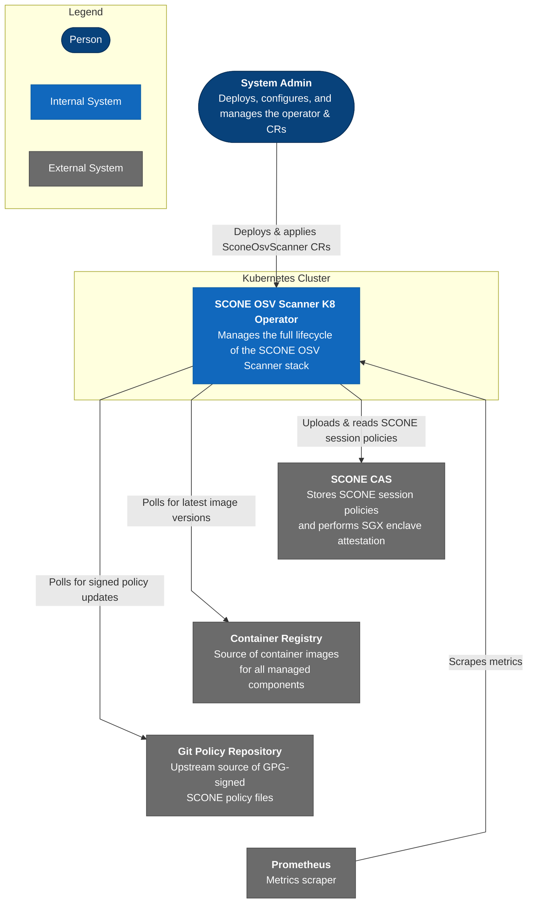

## Context

```mermaid
%%{init: {"flowchart": {"curve": "linear"}}}%%
flowchart TB
    devops(["<b>System Admin</b><br/>Deploys, configures, and manages the operator & CRs"])

    subgraph k8s["Kubernetes Cluster"]
        operator["<b>SCONE OSV Scanner K8 Operator</b><br/>Manages the full lifecycle of the SCONE OSV Scanner stack"]
    end

    cas["<b>SCONE CAS</b><br/>Stores SCONE session policies<br/>and performs SGX enclave attestation"]
    registry["<b>Container Registry</b><br/>Source of container images<br/>for all managed components"]
    gitrepo["<b>Git Policy Repository</b><br/>Upstream source of GPG-signed<br/>SCONE policy files"]
    prometheus["<b>Prometheus</b><br/>Metrics scraper"]

    devops -->|"Deploys & applies SconeOsvScanner CRs"| operator
    operator -->|"Uploads & reads SCONE session policies"| cas
    operator -->|"Polls for latest image versions"| registry
    operator -->|"Polls for signed policy updates"| gitrepo
    prometheus -->|"Scrapes metrics"| operator

    cas ~~~ registry ~~~ gitrepo ~~~ prometheus

    subgraph legend["Legend"]
        l_person(["Person"])
        l_system["Internal System"]
        l_external["External System"]
    end

    classDef system fill:#1168bd,stroke:#0e5fa3,color:#fff
    classDef external fill:#6b6b6b,stroke:#4a4a4a,color:#fff
    classDef person fill:#08427b,stroke:#052e56,color:#fff

    class operator,l_system system
    class cas,registry,gitrepo,prometheus,l_external external
    class devops,l_person person
```